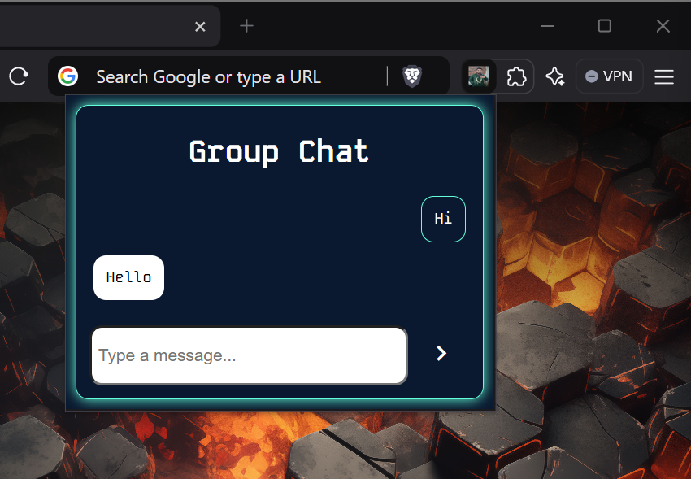

# Group Chat Extension

Welcome to the Group Chat Extension! This browser extension allows you to create or join rooms and chat with your friends and family in real time. It features an attractive and user-friendly interface to enhance your chatting experience.

## Features

- **Create or Join Rooms:** Easily create or join chat rooms to connect with others.
- **Real-Time Messaging:** Send and receive messages instantly.
- **Attractive UI:** Enjoy a visually appealing and intuitive user interface.

## Installation Guide

Follow these steps to set up and use the Group Chat Extension:

### Step 1: Download the Extension

1. Download the zip folder from the following link:
   [Download Group Chat Extension](https://drive.google.com/drive/folders/16cNJ1K_ZQ8J8omlJgh-vkdhi3ibHNljc?usp=sharing)

### Step 2: Extract the Folder

2. Extract the downloaded zip folder to your preferred location on your computer.

### Step 3: Enable Developer Mode in Your Browser

3. Open your browser and go to the extensions page. You can typically find this by navigating to:
   - **Chrome:** `chrome://extensions/`
   - **Edge:** `edge://extensions/`
   - **Firefox:** Use the add-on page to load temporary add-ons.

4. Turn on **Developer Mode** (usually a toggle at the top right of the extensions page).

### Step 4: Load the Unpacked Extension

5. Click on **Load unpacked** (or similar, depending on your browser).
6. Select the extracted folder from Step 2.

### Step 5: Start Chatting

7. Once the extension is loaded, click on the Group Chat Extension icon in your browser.
8. Create a new chat room or join an existing one to start talking with your friends and family!

## Screenshots

